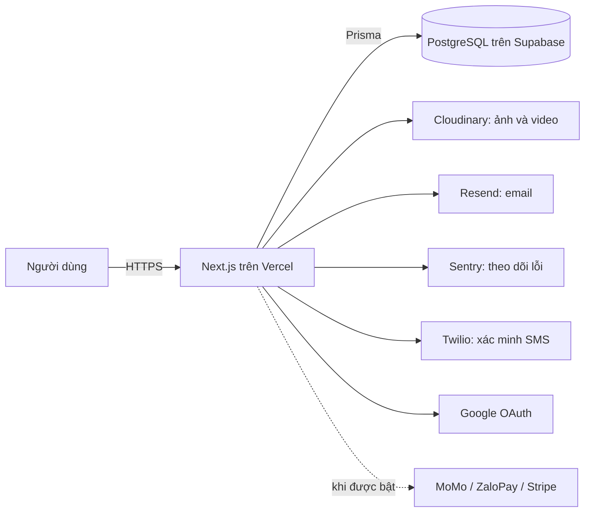
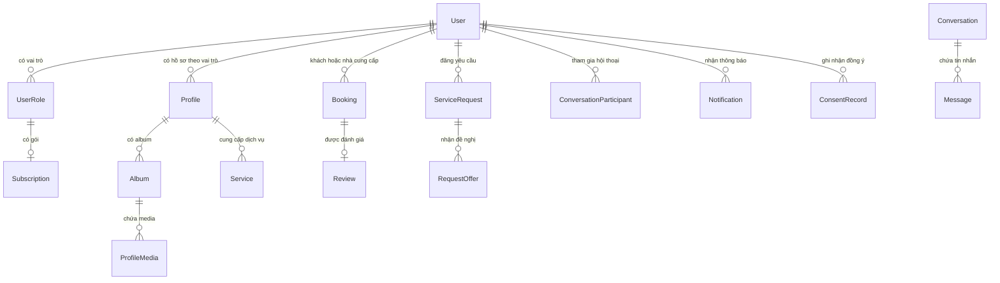

# Kiến trúc Fgrapher

Tài liệu này là bản đồ kỹ thuật của dự án. Nó dành cho người mới cần biết một
request đi qua đâu, dữ liệu nằm ở đâu và mỗi thư mục chịu trách nhiệm gì.

## 1. Hệ thống làm gì?

Fgrapher là nền tảng kết nối khách hàng với người cung cấp dịch vụ sáng tạo như
nhiếp ảnh gia, quay phim, trang điểm, người mẫu và studio. Hệ thống có hồ sơ công
khai, portfolio, tìm kiếm, đặt lịch, yêu cầu dịch vụ, nhắn tin, đánh giá, thông báo
và trang quản trị. Một số phần như marketplace hoặc thanh toán chỉ hoạt động khi
feature flag tương ứng được bật.

Không có server realtime riêng. Tin nhắn và thông báo hiện dùng polling: trình
duyệt gọi API định kỳ, tự dừng khi tab bị ẩn và tải lại khi người dùng quay lại.

## 2. Công nghệ chính

| Công nghệ                        | Vai trò                                                        |
| -------------------------------- | -------------------------------------------------------------- |
| Next.js 16, React 19             | Trang, Server Component, Client Component và API Route Handler |
| TypeScript                       | Kiểm tra kiểu dữ liệu trong code                               |
| PostgreSQL, Supabase             | Lưu dữ liệu lâu dài                                            |
| Prisma 6                         | Schema, migration và truy cập PostgreSQL                       |
| NextAuth/Auth.js v5              | Đăng nhập bằng mật khẩu và Google                              |
| Zod                              | Kiểm tra dữ liệu đầu vào lúc chương trình chạy                 |
| Tailwind CSS, shadcn/ui, Base UI | Giao diện và component nền                                     |
| Cloudinary                       | Upload, lưu và biến đổi ảnh/video                              |
| Resend                           | Gửi email                                                      |
| Vercel                           | Build, Preview, Production và cron                             |
| Playwright                       | Kiểm thử trình duyệt                                           |
| Sentry                           | Thu thập lỗi runtime khi được cấu hình                         |

Phiên bản cụ thể nằm trong `package.json`. Khi đọc tài liệu bên ngoài, phải chọn
đúng phiên bản vì Next.js, React, Prisma và NextAuth thay đổi API khá nhanh.

## 3. Cấu trúc thư mục

| Đường dẫn             | Trách nhiệm                                          |
| --------------------- | ---------------------------------------------------- |
| `src/app/(public)`    | Trang ai cũng có thể xem                             |
| `src/app/(auth)`      | Đăng nhập, đăng ký, quên mật khẩu                    |
| `src/app/(dashboard)` | Khu vực người dùng đã đăng nhập                      |
| `src/app/(admin)`     | Khu vực quản trị                                     |
| `src/app/api`         | HTTP API và webhook                                  |
| `src/components`      | Component giao diện dùng lại                         |
| `src/services`        | Quy tắc nghiệp vụ phía server                        |
| `src/lib`             | Auth, database, email, cache, validation và tiện ích |
| `src/hooks`           | Logic React dùng lại ở client                        |
| `src/messages`        | Chuỗi giao diện tiếng Việt/Anh                       |
| `prisma`              | Schema, migration và dữ liệu seed                    |
| `e2e`                 | Kiểm thử Playwright                                  |
| `scripts`             | Công cụ bảo trì và kiểm tra an toàn                  |
| `.github/workflows`   | CI và quy trình migration production                 |

Route Handler chỉ nên nhận request, kiểm tra auth/validation rồi gọi service.
Service giữ business logic. Prisma tập trung truy cập database. Tách như vậy giúp
cùng một quy tắc được dùng từ API, Server Component, cron và test.

## 4. Luồng một request

Ví dụ người dùng mở trang tìm kiếm:

1. `src/proxy.ts` xử lý locale và chốt chuyển hướng cơ bản.
2. `page.tsx` nhận `searchParams`.
3. Server Component gọi trực tiếp `services/search.ts`.
4. Service tạo Prisma query có filter, phân trang và sort.
5. Prisma gửi SQL tới PostgreSQL.
6. Kết quả được đổi thành dữ liệu vừa đủ cho `ArtistCard`.
7. React render HTML; phần tương tác được hydrate trên trình duyệt.

Server Component không cần gọi vòng qua API của chính ứng dụng. API tồn tại cho
Client Component hoặc bên ngoài; code chạy cùng server có thể gọi service trực tiếp.

## 5. Mô hình dữ liệu

`prisma/schema.prisma` hiện có 48 model. Những quan hệ chính:

### Vì sao tách `User`, `UserRole` và `Profile`?

- `User` là một tài khoản và thông tin đăng nhập.
- `UserRole` là vai trò đang có hiệu lực, ví dụ Photographer hoặc Model.
- `Profile` là nội dung công khai riêng cho từng vai trò.

Một người có nhiều vai trò nhưng vẫn chỉ có một tài khoản. Việc tách bảng tránh
nhân đôi email, mật khẩu và thông tin chung.

### Các cơ chế bảo vệ dữ liệu

- Primary key nhận diện duy nhất một dòng.
- Foreign key giữ quan hệ không bị mồ côi.
- Unique constraint ngăn dữ liệu trùng.
- Index giúp query lọc/sort nhanh hơn.
- Transaction giữ nhiều thay đổi cùng thành công hoặc cùng rollback.
- `deletedAt` hỗ trợ xoá mềm khi cần thời gian khôi phục hoặc lưu audit.

## 6. Đăng nhập và phân quyền

NextAuth dùng hai cách đăng nhập:

- Credentials: email và mật khẩu hash bằng bcrypt.
- Google OAuth: Google xác nhận danh tính; Fgrapher không thấy mật khẩu Google.

Session dùng JWT. Callback session đọc vai trò hiện tại để thay đổi quyền được phản
ánh mà không cần ghi vai trò cố định mãi trong token.

Hai tầng bảo vệ:

1. `src/proxy.ts` chuyển người chưa đăng nhập khỏi khu vực cần auth.
2. Page/API vẫn gọi `requireAuth()`, `requireRole()` hoặc `requireAdmin()`.

Tầng thứ hai mới là ranh giới bảo mật. Chỉ ẩn nút hoặc dựa vào redirect ở giao diện
không ngăn được người dùng tự gọi API.

## 7. Service và các miền nghiệp vụ

| Nhóm               | Service tiêu biểu                                                   |
| ------------------ | ------------------------------------------------------------------- |
| Hồ sơ và tìm kiếm  | `public-profile.ts`, `search.ts`, `geography.ts`                    |
| Portfolio          | `albums.ts`, `moderation.ts`                                        |
| Đặt lịch           | `bookings.ts`, `availability.ts`                                    |
| Yêu cầu dịch vụ    | `service-requests.ts`, `request-offers.ts`                          |
| Tin nhắn           | `messaging.ts`                                                      |
| Đánh giá           | `reviews.ts`                                                        |
| Email và thông báo | `notification.ts`, `email-outbox.ts`                                |
| Tài khoản          | `email-verification.ts`, `password-reset.ts`, `credential-email.ts` |
| Thanh toán         | `payments.ts`, `subscription.ts`                                    |
| Tuân thủ           | `compliance.ts`, `verification.ts`                                  |
| Quản trị           | `admin.ts`, `role-change-requests.ts`                               |

## 8. Tích hợp bên ngoài

| Dịch vụ             | Dùng cho                   | Khi dịch vụ lỗi                                        |
| ------------------- | -------------------------- | ------------------------------------------------------ |
| Supabase PostgreSQL | Dữ liệu chính              | Phần lớn website không thể xử lý                       |
| Cloudinary          | Ảnh/video và signed upload | Upload mới lỗi; media cũ thường vẫn xem được           |
| Resend              | Email giao dịch            | Nghiệp vụ chính vẫn hoàn tất; outbox thử lại           |
| Google OAuth        | Đăng nhập Google           | Người dùng vẫn có thể dùng credentials nếu đã có       |
| Twilio Verify       | Mã SMS                     | Chức năng yêu cầu xác minh điện thoại bị ảnh hưởng     |
| Sentry              | Quan sát lỗi               | Website vẫn chạy nhưng đội vận hành mất cảnh báo       |
| Cổng thanh toán     | Thu phí khi flag bật       | Intent/webhook phải chuyển trạng thái an toàn và retry |

Webhook có thể đến lặp hoặc sai thứ tự. Handler phải xác minh chữ ký, dùng unique
event/idempotency key và chỉ cho phép chuyển trạng thái hợp lệ.

## 9. Email, cron và công việc nền

Email dùng bảng outbox để tách thao tác gửi mạng khỏi nghiệp vụ chính. Nếu Resend
lỗi tạm thời, cron `email-retry` thử lại với backoff. Token bí mật không được lưu
nguyên văn trong payload hàng đợi.

Các cron còn xử lý nhắc provider cập nhật lịch bận lúc 07:30 giờ Việt Nam, nhắc
lịch hẹn, hết hạn booking/yêu cầu/gói, tài liệu KYC và media trong thùng rác. Mọi
cron production phải fail closed khi thiếu hoặc sai `CRON_SECRET`, và phải an
toàn nếu hai lần chạy chồng nhau.

## 10. Cache và hiệu năng

Dữ liệu công khai ít thay đổi có thể dùng `unstable_cache` và cache tag. Dữ liệu
theo người dùng hoặc thay đổi nhanh phải cân nhắc kỹ để tránh lộ hoặc hiển thị cũ.
Sau mutation cần invalidate đúng tag.

Các rủi ro thường gặp:

- N+1 query khi đọc thêm dữ liệu từng dòng;
- gọi database tuần tự dù các query độc lập;
- polling trùng do render hai bản desktop/mobile;
- trả quá nhiều cột hoặc dòng;
- tải nhiều ảnh/bundle hơn phần đang hiển thị.

Mọi tối ưu phải dựa trên phép đo request, query, bundle và trải nghiệm thật.

## 11. Feature flag

Feature flag nằm ở `src/lib/env.ts` và `src/lib/features.ts`. Các công tắc chính:

- `BILLING_ENABLED`, `FREE_ROLE_GRANT_ENABLED`;
- `MARKETPLACE_ENABLED`, `SOCIAL_FEED_ENABLED`;
- `PHONE_VERIFICATION_REQUIRED`;
- `MOMO_ENABLED`, `ZALOPAY_ENABLED`, `BANK_TRANSFER_ENABLED`;
- `CONTENT_MODERATION_ENABLED`.

Flag phải được kiểm tra trên server và giao diện. Khi tắt, API liên quan cũng phải
từ chối hoặc không trả dữ liệu, không chỉ ẩn nút.

## 12. Quy ước quan trọng

- API trả cấu trúc nhất quán `{ data, error, message }`.
- Dùng đúng status HTTP: 400 dữ liệu sai, 401 chưa đăng nhập, 403 không có quyền,
  404 không tìm thấy, 409 xung đột, 429 quá nhiều request, 500 lỗi server.
- Zod kiểm tra mọi input từ Internet ở server.
- Mặc định dùng Server Component; chỉ thêm `"use client"` khi cần state/event/API
  trình duyệt.
- Không log mật khẩu, token, secret hoặc ảnh giấy tờ.
- Chuỗi giao diện nằm trong hệ thống i18n khi khu vực đó hỗ trợ đa ngôn ngữ.
- Migration và code phải tương thích trong cửa sổ deploy.

Xem `docs/ops/CAM-NANG-KIEN-THUC-IT-FGRAPHER.md` nếu cần giải thích sâu từng
thuật ngữ và `docs/DEVELOPMENT.md` để bắt đầu làm việc với code.
