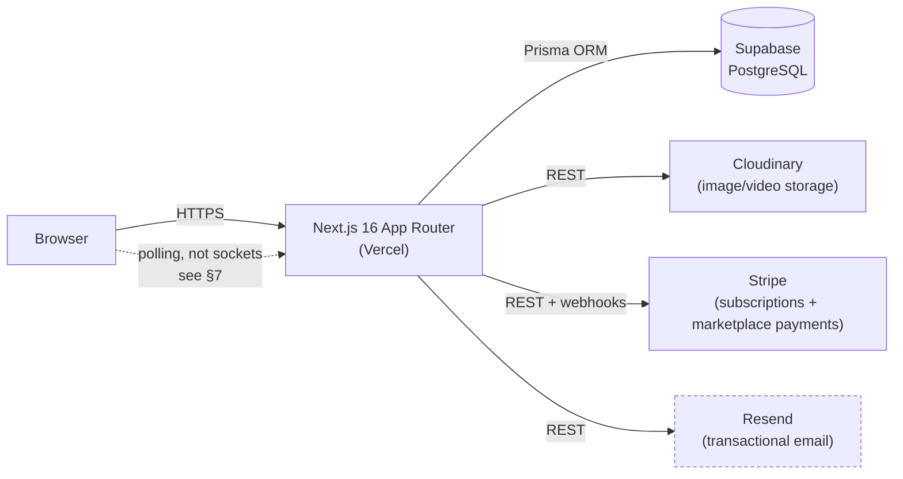
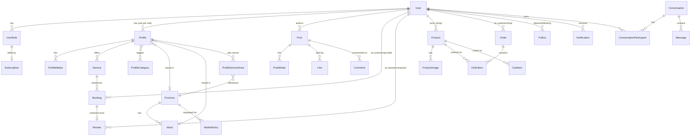

# Architecture

Technical reference for maintaining Fgrapher. Written for someone who has
never seen this codebase before.

## 1. System overview

Fgrapher is a social-media-style booking and marketplace platform for the
photography/videography industry in Vietnam. People who provide creative
services — photographers, videographers, make-up artists, studios, camera
shops (and models, once Phase 12's follow-up work lands) — pay a monthly
subscription to run a public profile with a portfolio, receive bookings from
customers, message clients, and (for camera shops) sell or rent gear.
Customers browse and book for free. One account can hold multiple paid roles
at once, each billed as its own subscription.



There is no separate real-time server: messaging and notifications poll
existing API routes on an interval (§7) rather than using Socket.io, despite
Socket.io being listed in the intended stack — see the note in §7.

## 2. Tech stack

| Dependency                               | Version                   | Used for                                                                                                   | Config                                                               |
| ---------------------------------------- | ------------------------- | ---------------------------------------------------------------------------------------------------------- | -------------------------------------------------------------------- |
| Next.js                                  | 16.3.1                    | App Router framework, RSC, route handlers                                                                  | `next.config.ts`                                                     |
| React                                    | 19.2.8                    | UI                                                                                                         | —                                                                    |
| TypeScript                               | ^5                        | Strict-mode typing across the app                                                                          | `tsconfig.json`                                                      |
| Prisma                                   | ^6.19.3                   | ORM + migrations against Supabase Postgres                                                                 | `prisma/schema.prisma`                                               |
| `@prisma/client`                         | ^6.19.3                   | Generated DB client, singleton at `src/lib/db.ts`                                                          | —                                                                    |
| NextAuth.js                              | 5.0.0-beta.32             | Auth (credentials + Google OAuth), JWT sessions                                                            | `src/lib/auth.ts`                                                    |
| `@auth/prisma-adapter`                   | ^2.11.3                   | Persists OAuth accounts/sessions via Prisma                                                                | `src/lib/auth.ts`                                                    |
| `@supabase/supabase-js`, `@supabase/ssr` | ^2.112.3 / ^0.12.4        | Installed for Supabase-specific features outside the Prisma layer; not currently used for any live feature | —                                                                    |
| Tailwind CSS                             | ^4                        | Styling                                                                                                    | `src/app/globals.css` (v4 CSS-first config, no `tailwind.config.ts`) |
| shadcn/ui                                | ^4.18.0 (CLI)             | Base component primitives, incrementally rebuilt against brand tokens                                      | `src/components/ui/`                                                 |
| `@base-ui/react`                         | ^1.7.0                    | Unstyled primitives (Tabs, etc.) styled to match the design system                                         | `src/components/ui/tabs.tsx` and similar                             |
| next-intl                                | ^4.13.7                   | i18n (EN/VI), cookie-based, no `[locale]` segment                                                          | `src/i18n/`                                                          |
| next-themes                              | ^0.4.6                    | Dark mode via `class` strategy                                                                             | `src/app/layout.tsx`                                                 |
| Cloudinary SDK                           | ^2.10.0                   | Signed direct-to-Cloudinary uploads                                                                        | `src/lib/cloudinary.ts`                                              |
| Stripe SDK                               | ^22.5.0                   | Subscriptions (14-day trial) + marketplace one-off payments                                                | `src/lib/stripe.ts`                                                  |
| `@stripe/stripe-js`                      | ^9.13.0                   | Client-side Stripe Checkout redirect                                                                       | —                                                                    |
| Resend                                   | ^6.20.0                   | Transactional email (no-ops without `RESEND_API_KEY`)                                                      | `src/lib/email.ts`                                                   |
| react-hook-form + `@hookform/resolvers`  | ^7.85.0 / ^5.8.0          | Form state + Zod validation binding                                                                        | per-form components                                                  |
| Zod                                      | ^4.4.3                    | Schema validation, single source of truth for input types                                                  | `src/lib/validations/`                                               |
| bcryptjs                                 | ^3.0.3                    | Password hashing for credentials auth                                                                      | `src/lib/auth.ts`                                                    |
| `@dnd-kit/*`                             | ^6.3.1 / ^10.0.0 / ^3.2.2 | Drag-to-reorder (portfolio media)                                                                          | `src/components/**/reorder*`                                         |
| react-dropzone                           | ^20.1.0                   | Upload dropzones                                                                                           | upload components                                                    |
| react-day-picker, date-fns               | ^10.0.1 / ^4.4.0          | Calendar UI + date math                                                                                    | booking/availability components                                      |
| Playwright                               | ^1.62.1 (dev)             | E2E, smoke, and visual-regression tests                                                                    | `e2e/`, `playwright.config.ts`                                       |

No `test`/Vitest setup exists despite the root `CLAUDE.md` documenting
`pnpm test # vitest` — see §9 Technical debt.

## 3. Folder structure

```
src/
  app/
    (auth)/           # login, register (redirects into /login), forgot/reset password
    (dashboard)/      # role-based provider/customer dashboard, settings, billing
    (admin)/          # ADMIN-only route group: overview, user mgmt, moderation queue
    (public)/         # public profiles, browse/search, landing, pricing, marketplace
    onboarding/        # post-signup role/billing setup, outside the above groups
    api/              # Route Handlers, one route.ts per resource — see §6/§9
    layout.tsx
    page.tsx
  components/
    ui/               # shadcn/ui primitives rebuilt against brand tokens
    layout/           # Header, Footer, Sidebar, MobileNav, WebNav
    brand/            # LogoMark, LogoFull
    sections/         # page-section components (HeroSearch, ...)
    forms/            # reusable form components
    cards/            # ProfileCard, ArtistCard, PostCard, ProductCard, BookingCard
    modals/           # booking modal, upload modal, confirm modal
    browse/, chat/, admin/, ...  # feature-scoped component groups
  lib/
    db.ts             # Prisma client singleton (globalThis-cached in dev)
    auth.ts            # NextAuth config + cached auth()
    auth-helpers.ts    # requireAuth/requireRole/requireActiveSubscription/...
    admin.ts           # requireAdmin() + logAdminAction()
    stripe.ts          # Stripe client + checkout/portal/refund helpers
    cloudinary.ts       # signed-upload helper
    email.ts            # Resend wrapper + every email template (HTML strings)
    utils.ts            # cn(), formatCurrency(), etc.
    constants/          # PAID_ROLES, ROLE_LABELS, plans.ts (pricing/Stripe price IDs)
    validations/        # Zod schemas per domain
  i18n/               # next-intl routing/request config + locale server action
  messages/           # en.json / vi.json translation catalogs
  hooks/              # custom React hooks
  types/              # shared TypeScript types/interfaces
  services/           # server-side business logic, one file per domain — see §5
  proxy.ts            # locale-detection + route-protection middleware (Next 16 "proxy")
prisma/
  schema.prisma
  migrations/
  seed.ts
docs/
  design-reference/   # Claude Design export + extracted design-tokens.md
  guides/             # phase-by-phase build guides (source of the current plan)
e2e/                  # Playwright specs + .env.test
```

**Rule for where new code goes:** business logic that touches the database
or external services belongs in `src/services/<domain>.ts`, never inline in
a route handler or a Server Component — route handlers validate input and
call a service function; Server Components call the same service functions
directly (no HTTP round-trip to your own API for server-rendered reads).
UI-only logic (formatting, conditional classes) stays in the component or
`lib/utils.ts`.

## 4. Data model

41 models across `prisma/schema.prisma` (1235 lines). Full ER diagram below;
grouped by domain in the tables that follow it.



**Why `User → UserRole → Profile` is three tables, not one:** a person is
one `User` row regardless of how many roles they hold. Each role they
activate is a separate `UserRole` row (`@@unique([userId, role])`), which is
what a `Subscription` bills against — one Stripe SubscriptionItem per role.
Each paid role additionally gets its own `Profile` row (`@@unique([userId,
role])`) holding the role-specific public content: portfolio media,
services, pricing, category tags. Collapsing these would either force one
subscription per user (wrong — roles bill independently and can lapse
independently) or force one profile per user (wrong — a Photographer+Studio
account needs two visually distinct profile pages with different fields,
media, and pricing). `services/search.ts`'s `groupProfilesByUser` is the
place this three-table split shows up most concretely: it re-collapses
multiple `Profile` rows back onto one card per person for search results.

### Core tables

| Model                                                  | Key fields                                                                                                                                                                                | Purpose                                                                                                                                                                                                                             | Indexes                                                                                                        |
| ------------------------------------------------------ | ----------------------------------------------------------------------------------------------------------------------------------------------------------------------------------------- | ----------------------------------------------------------------------------------------------------------------------------------------------------------------------------------------------------------------------------------- | -------------------------------------------------------------------------------------------------------------- |
| `User`                                                 | `email` (unique), `passwordHash?`, `username?` (unique), `deletedAt?` (soft delete), `acceptingBookings`, `notificationPreferences` (Json), `isSuspended`/`isVerified` (admin moderation) | One row per person, regardless of role count                                                                                                                                                                                        | —                                                                                                              |
| `UserRole`                                             | `userId`, `role` (enum), `active`                                                                                                                                                         | One row per activated role                                                                                                                                                                                                          | `@@unique([userId, role])`                                                                                     |
| `Subscription`                                         | `userRoleId` (unique), `stripeSubscriptionItemId` (unique), `status`, `graceEndsAt`                                                                                                       | Billing state for one role                                                                                                                                                                                                          | —                                                                                                              |
| `Profile`                                              | `userId`, `role`, `priceMin/Max`, `isPublished`, `provinceId?`/`wardId?` (business location), `servesNationwide`, studio/shop-specific fields                                             | Public role-specific page content                                                                                                                                                                                                   | `@@unique([userId, role])`, `[role, isPublished]`, `[role, isPublished, provinceId]`, `[provinceId, priceMin]` |
| `ProfileMedia`                                         | `profileId`, `url`, `publicId` (Cloudinary), `type`, `order`                                                                                                                              | Portfolio images/videos                                                                                                                                                                                                             | `[profileId, order]`                                                                                           |
| `Service`                                              | `profileId`, `price`, `duration`                                                                                                                                                          | A bookable offering under a profile                                                                                                                                                                                                 | `[profileId]`                                                                                                  |
| `Province` / `Ward`                                    | `code` (slug, not an asserted GSO code), `name`                                                                                                                                           | Real Vietnam administrative geography (Prompt B4) — currently only Thành phố Hồ Chí Minh's 168 wards are seeded (`prisma/data/hcmc-wards.ts`); more provinces are added via `prisma/data/provinces-registry.ts` as they're supplied | `[provinceId]` (Ward)                                                                                          |
| `ProfileServiceArea`                                   | `profileId`, `provinceId`, `isPrimary`                                                                                                                                                    | Extra provinces a profile takes bookings in, beyond its primary `Profile.provinceId`                                                                                                                                                | `@@id([profileId, provinceId])`, `[provinceId]`                                                                |
| `WaitlistEntry`                                        | `email`, `provinceId`, `role`                                                                                                                                                             | "Notify me" capture from `/browse`'s empty state when a province+role search is thin                                                                                                                                                | `[provinceId, role]`                                                                                           |
| `Booking`                                              | `customerId`, `providerId`, `serviceId?`, `date`, `status`, `provinceId?` (provider's province at creation time), reschedule-proposal fields                                              | One booking request/engagement                                                                                                                                                                                                      | `[customerId]`, `[providerId, status]`, `[date]`                                                               |
| `Review`                                               | `bookingId` (unique — one review per booking), `rating` 1-5, `response?`                                                                                                                  | Customer review + optional provider reply                                                                                                                                                                                           | `[reviewedId, rating]`                                                                                         |
| `Product` / `ProductImage`                             | shop-owned listing, `type` SALE/RENT/BOTH                                                                                                                                                 | Camera Shop marketplace listings                                                                                                                                                                                                    | `[userId, isActive]`, `[category]`                                                                             |
| `Order` / `OrderItem`                                  | `shopId` — every order is split to one shop even from a multi-shop cart                                                                                                                   | Marketplace purchase/rental                                                                                                                                                                                                         | `[customerId]`, `[shopId, status]`                                                                             |
| `Conversation` / `ConversationParticipant` / `Message` | per-participant `lastReadAt` for read receipts/unread counts                                                                                                                              | Messaging                                                                                                                                                                                                                           | `[userId, conversationId]`, `[conversationId, createdAt]`                                                      |
| `Notification`                                         | `type` (23-value enum), `data` (Json context)                                                                                                                                             | In-app + email trigger record                                                                                                                                                                                                       | `[userId, readAt, createdAt]`                                                                                  |
| `Report` / `AdminAction`                               | `targetType`/`targetId` loose reference (not a Prisma relation — points at several model types)                                                                                           | Moderation queue / admin audit trail                                                                                                                                                                                                | `[status, createdAt]`, `[adminId, createdAt]`                                                                  |
| `WebhookEvent`                                         | `id` = Stripe event ID                                                                                                                                                                    | Idempotency guard for retried Stripe webhooks                                                                                                                                                                                       | —                                                                                                              |

Every table has `id` (cuid), and every table that represents user-generated
content that should survive deletion requests has `createdAt`/`updatedAt`
plus a nullable `deletedAt` for soft delete (`User`, `Post`, `Comment`,
`Product`) — see `docs/OPERATIONS.md` for what soft delete means in practice
for a deletion request.

## 5. Request lifecycle — searching `/browse`

Concrete trace of one request, file by file:

1. **`src/proxy.ts`** runs first (Next's "proxy" convention — see the
   `CLAUDE.md` root note that this is _not_ the Next.js you know). `/browse`
   isn't in `PROTECTED_PREFIXES` or `AUTH_ONLY_PREFIXES`, so it only decodes
   the JWT via `getToken()` (no DB call) to set the locale cookie and passes
   through.
2. **`src/app/(public)/browse/page.tsx`**, a Server Component, receives
   `searchParams` as an async prop (Next 16 convention) and awaits it.
3. It calls **`services/search.ts`'s `searchProfiles()`** directly — no
   internal HTTP call to `/api/search`; that route exists separately for any
   client-side consumer, but Server Components call the service function in
   the same process.
4. `searchProfiles()` resolves `params.city` (a `Province.code`, populated
   from the real `/api/geography/provinces` list — never a hardcoded city
   name) to a `Province` row, then issues the shared match → hydrate → rate
   → sort pipeline (`resolveProviderCards()`) against Supabase Postgres
   through the pooled `DATABASE_URL` connection: (a) find matching `Profile`
   rows, filtered by `provinceId` OR a `ProfileServiceArea` row when a
   province is active, (b) pull every published profile for those matched
   users (so a multi-role person's card shows all their roles), (c)
   `groupBy` on `Review` for rating aggregates. When a province filter is
   active and the result is thin (< 5), the same pipeline runs a second time
   for `servesNationwide: true` profiles, excluding anyone already in the
   primary result, and returns them as a separate `nationwide` array —
   `page.tsx` renders that as its own section, never merged into the main
   grid (Prompt B4 VIỆC 4). Role counts are fetched in parallel via
   `Promise.all`. Nothing here is cached — every request hits Supabase
   fresh. This is also why filter clicks on `/browse` measurably take over a
   second in this environment (remote Supabase pooler round-trip); see the
   fix and its context in `src/components/browse/filter-sidebar.tsx`.
5. Results stream back into `page.tsx`, which renders `ArtistCard`s.
   `FilterSidebar` and `MobileFilterSheet` (Client Components) render
   alongside it, reading/writing the same `searchParams` via
   `next/navigation`, wrapped in a shared `BrowseFilterProvider` so a
   pending filter navigation can visually dim the results pane while the
   next `page.tsx` render is in flight.
6. `SearchInput` (free-text) debounces client-side before calling
   `router.push()`; discrete filters (checkboxes/radios/selects) update
   local optimistic state immediately and batch their own `router.push()`
   after a short window — see `filter-sidebar.tsx` for the full rationale.

## 6. Authentication and authorization

- **NextAuth v5** (`src/lib/auth.ts`), JWT session strategy, `PrismaAdapter`
  for OAuth account/session persistence. Two providers: `Credentials`
  (bcrypt-compared password) and `Google`.
- The `session` callback re-fetches active `UserRole`s from the DB **on
  every call** (not baked into the JWT at sign-in), so a role/subscription
  change is reflected without forcing a re-login. Because `auth()` isn't
  request-memoized by NextAuth itself, it's wrapped in React's `cache()` so
  a layout and a page calling `auth()` in the same request share one query.
- **Session shape**: `session.user.id`, `session.user.avatar`,
  `session.user.roles: Role[]` — extended via NextAuth's module augmentation
  (search the codebase for `declare module "next-auth"` if the type isn't
  where expected).
- **Route protection** happens in two layers:
  - `src/proxy.ts` — redirects unauthenticated visitors away from
    `/dashboard` and `/admin` (JWT-decode only, via `getToken()`, no DB
    call — safe for the edge/proxy runtime), and bounces authenticated
    visitors away from `/login`/`/register`.
  - Per-route/page guards in `src/lib/auth-helpers.ts` and
    `src/lib/admin.ts`, called explicitly at the top of every protected API
    route and server action:
    - `requireAuth()` — throws `AuthError(401)` if no session.
    - `requireRole(userId, role)` — throws `AuthError(403)` if the
      `UserRole` row is missing/inactive.
    - `requireActiveSubscription(userId, role)` — `requireRole` plus a
      subscription-usability check (`ACTIVE`/`TRIALING`, or `PAST_DUE`
      still inside `graceEndsAt`).
    - `requireAnyRole(session, roles)` — session-only (no DB call), for
      fast "any paid role" gates.
    - `requirePaidRole(userId)` — "does this user have _any_ paid role with
      a usable subscription."
    - `requireAdmin()` (`src/lib/admin.ts`) — `requireAuth()` plus an
      active `ADMIN` `UserRole` check. Pair every admin mutation with
      `logAdminAction()` to write an `AdminAction` audit row.
  - `AuthError` carries its intended HTTP status (401 or 403); every route
    handler catches it and maps it straight to `NextResponse.json(...,
{status: err.status})` — see §9 for the exact response shape.
- **Admin is not selectable at registration** — it's granted via
  `scripts/make-admin.ts` only, and `/admin` is protected by `proxy.ts` like
  `/dashboard`, but the actual ADMIN role check happens page-side via
  `requireAdmin()`, not in the proxy.

## 7. External integrations

| Integration                                 | What it does                                                                                                           | Files                                                                                                                                  | Env vars                                                                                                                                                   | If it goes down                                                                                                                   |
| ------------------------------------------- | ---------------------------------------------------------------------------------------------------------------------- | -------------------------------------------------------------------------------------------------------------------------------------- | ---------------------------------------------------------------------------------------------------------------------------------------------------------- | --------------------------------------------------------------------------------------------------------------------------------- |
| **Supabase Postgres**                       | Primary datastore, via Prisma                                                                                          | `src/lib/db.ts`, `prisma/schema.prisma`                                                                                                | `DATABASE_URL` (pooled, app runtime), `DIRECT_URL` (direct, migrations only)                                                                               | Total outage — every page and route depends on it                                                                                 |
| **Cloudinary**                              | Portfolio/product/message image & video storage, signed direct-from-browser uploads                                    | `src/lib/cloudinary.ts`, `src/app/api/upload/signature/route.ts`                                                                       | `NEXT_PUBLIC_CLOUDINARY_CLOUD_NAME`, `CLOUDINARY_API_KEY`, `CLOUDINARY_API_SECRET`                                                                         | Uploads no-op gracefully (`isCloudinaryConfigured()` gate); existing images keep rendering                                        |
| **Stripe**                                  | Subscription billing (14-day trial, monthly/yearly) + marketplace one-off checkout, Customer Portal, refunds           | `src/lib/stripe.ts`, `src/app/api/stripe/*`, `src/app/api/webhooks/stripe/route.ts`, `src/lib/constants/plans.ts`                      | `STRIPE_SECRET_KEY`, `NEXT_PUBLIC_STRIPE_PUBLISHABLE_KEY`, `STRIPE_WEBHOOK_SECRET`, `STRIPE_PRICE_<ROLE>_MONTHLY/YEARLY` (10 vars, one pair per paid role) | All Stripe-touching calls throw `StripeNotConfiguredError`/no-op via `isStripeConfigured()`; new signups can't start a paid trial |
| **Resend**                                  | Transactional email — every notification type has an HTML template in `src/lib/email.ts`                               | `src/lib/email.ts`                                                                                                                     | `RESEND_API_KEY`                                                                                                                                           | `sendEmail()` silently no-ops; in-app notifications still fire                                                                    |
| **Realtime layer (polling, not Socket.io)** | Chat panel polls every **4s** while open; conversation list polls every **15s**; notification bell polls every **30s** | `src/components/chat/chat-panel.tsx`, `src/app/(dashboard)/dashboard/messages/page.tsx`, `src/components/layout/notification-bell.tsx` | none                                                                                                                                                       | Messages/notifications just appear up to one poll interval late, never lost                                                       |

The Stripe webhook (`/api/webhooks/stripe`) handles 5 event types:
`checkout.session.completed`, `customer.subscription.updated`,
`invoice.paid`, `invoice.payment_failed`, `customer.subscription.deleted`.
Every processed event ID is recorded in `WebhookEvent` so a Stripe retry is
a no-op rather than double-applying a state change.

`@supabase/supabase-js` and `@supabase/ssr` are installed per the stack
decision in `CLAUDE.md` but nothing in the current codebase imports them —
all Postgres access goes through Prisma. Keep this in mind before assuming
a Supabase-specific feature (storage, realtime channels) exists; it doesn't
yet.

## 8. Environments

|           | Dev                                                                                                                           | Preview                                             | Production                                                                                             |
| --------- | ----------------------------------------------------------------------------------------------------------------------------- | --------------------------------------------------- | ------------------------------------------------------------------------------------------------------ |
| Database  | Supabase project (dev branch/instance)                                                                                        | Same or a Supabase preview branch, per deploy setup | Production Supabase project                                                                            |
| Deploy    | `pnpm dev`, localhost:3000                                                                                                    | Vercel preview deployment per PR/branch             | Vercel production deployment                                                                           |
| Stripe    | Test mode keys, `stripe listen` for local webhook forwarding                                                                  | Test mode                                           | Live mode (requires Stripe business verification — not done yet, see root `CLAUDE.md` "Current phase") |
| Env files | `.env` (Prisma CLI only reads this) + `.env.local` (Next.js runtime) — `DATABASE_URL`/`DIRECT_URL` must be duplicated in both | Vercel project env vars                             | Vercel project env vars, production scope                                                              |

**Rollback**: revert the Vercel deployment to the previous build (Vercel
dashboard or `vercel rollback`). Database migrations are not automatically
reversible — see `docs/OPERATIONS.md` §5 once written for the safe
migration/rollback procedure.

## 9. Conventions

- **API response shape**, every route handler: `{ data, error, message }`
  plus pagination fields (`total`, `page`, `totalPages`) on list endpoints.
  `error` is a short machine-readable slug (`"unauthorized"`,
  `"validation_error"`, `"server_error"`, or a domain-specific one like
  `"booking_error"`); `message` is human-readable. HTTP status always
  matches: 200/201/400/401/403/404/500.
- **Error handling pattern**: route handlers wrap their body in
  `try { ... } catch`, check `instanceof AuthError` first (maps to the
  error's own `.status`), then any domain-specific error class
  (`BookingActionError` and similar, one per service module that needs
  one), then fall through to a generic 500. Service functions throw typed
  errors; they never call `NextResponse` themselves.
- **Server vs Client Component rule**: default to Server Components; add
  `"use client"` only when the component needs state, effects, or event
  handlers that can't be pushed to a leaf component. Data fetching for
  initial render happens in Server Components calling `services/*`
  directly — never fetch your own API from a Server Component.
- **Naming**: Prisma models PascalCase, fields camelCase; components
  `kebab-case.tsx`, utilities `camelCase.ts`; commit messages
  `type(scope): description`.
- **Validation**: Zod schema is the single source of truth
  (`type X = z.infer<typeof xSchema>`), and every API route re-validates
  server-side even when the same schema already validated client-side in a
  form.

## Technical debt (found while writing this document)

- **No unit/component test runner exists.** Root `CLAUDE.md` documents
  `pnpm test # vitest`, but `package.json` has no `test` script and no
  Vitest dependency — only Playwright (`test:e2e`, `test:smoke`,
  `test:visual`). Either add Vitest or correct the documented command.
- **Cloudinary env var name mismatch**: `CLAUDE.md`'s environment list says
  `CLOUDINARY_CLOUD_NAME`; the actual variable read by
  `src/lib/cloudinary.ts` and `.env.example` is
  `NEXT_PUBLIC_CLOUDINARY_CLOUD_NAME` (it has to be public — the signed
  upload happens directly from the browser). Update the root doc.
- **`@supabase/supabase-js`/`@supabase/ssr` are unused dependencies** as of
  this writing — installed per the stack decision, no current import
  anywhere. Either use them for a Supabase-specific feature or note they're
  reserved for future use so a future cleanup pass doesn't remove them by
  mistake.
- **Socket.io is stack-documented but not implemented** — this is called
  out already in root `CLAUDE.md`'s "Current phase" notes as a deliberate
  architecture choice (polling now, swap the transport later), not
  accidental drift; listed here only so this document and that one agree.
