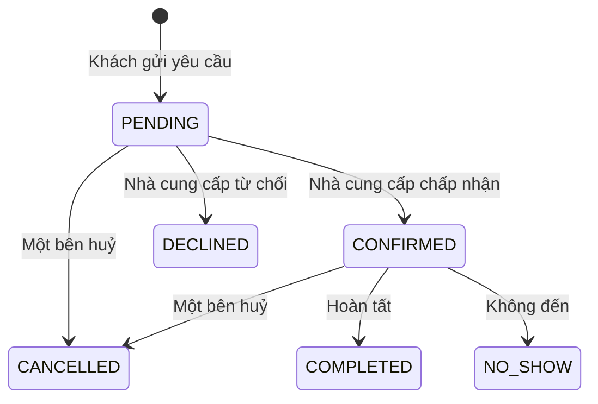

# Các tính năng của Fgrapher

Tài liệu này mô tả hành vi hiện tại ở mức sản phẩm. Code và feature flag mới là
nguồn quyết định cuối cùng; các guide Phase trong `docs/guides` chỉ là kế hoạch
lịch sử lúc xây dựng.

## 1. Công tắc tính năng

Các giá trị nằm trong `src/lib/env.ts`, được gom tại `src/lib/features.ts`.

| Công tắc                      | Mặc định      | Ý nghĩa                                           |
| ----------------------------- | ------------- | ------------------------------------------------- |
| `BILLING_ENABLED`             | Tắt           | Thanh toán subscription bằng Stripe               |
| `FREE_ROLE_GRANT_ENABLED`     | Bật           | Cấp gói miễn phí cho vai trò mới khi chưa thu phí |
| `MARKETPLACE_ENABLED`         | Tắt           | Shop, sản phẩm, giỏ hàng và đơn hàng              |
| `SOCIAL_FEED_ENABLED`         | Tắt           | Follow, post, like và comment                     |
| `PHONE_VERIFICATION_REQUIRED` | Theo cấu hình | Bắt xác minh SMS trước khi đăng yêu cầu dịch vụ   |
| `MOMO_ENABLED`                | Tắt           | Thanh toán subscription bằng MoMo                 |
| `ZALOPAY_ENABLED`             | Tắt           | Thanh toán subscription bằng ZaloPay              |
| `BANK_TRANSFER_ENABLED`       | Tắt           | Thanh toán chuyển khoản và admin xác nhận         |
| `CONTENT_MODERATION_ENABLED`  | Tắt           | Máy quét ảnh tự động trước hàng chờ người duyệt   |

Khi flag tắt, server phải chặn API hoặc không trả dữ liệu liên quan. Chỉ ẩn giao
diện không đủ bảo vệ.

## 2. Tài khoản và đăng nhập

Người dùng có thể:

- đăng ký bằng email/mật khẩu;
- xác minh email bằng link dùng một lần;
- đăng nhập Google OAuth;
- yêu cầu đặt lại mật khẩu;
- đổi email credential và xác minh địa chỉ mới;
- đăng xuất và quản lý thiết lập tài khoản.

Mật khẩu được hash bằng bcrypt. Token xác minh/reset có thời hạn, dùng một lần và
được lưu dạng hash khi luồng hỗ trợ. API gửi lại link không tiết lộ email có tồn tại
hay không.

Một tài khoản có thể có nhiều vai trò:

- Customer;
- Photographer;
- Videographer;
- Make-up Artist;
- Model;
- Studio;
- Camera Shop;
- Admin.

Admin không thể tự chọn khi đăng ký. Quyền admin được cấp bằng quy trình riêng.

## 3. Vai trò, gói và quyền truy cập

`UserRole` cho biết tài khoản đang có vai trò nào. Mỗi vai trò cung cấp dịch vụ có
thể có một `Profile` và trạng thái gói riêng. Tắt hoặc hết hạn một vai trò không
được làm hỏng các vai trò khác của cùng tài khoản.

Khi chưa thu phí, `FREE_ROLE_GRANT_ENABLED` cho phép cấp gói miễn phí. Admin có thể
gán hoặc gia hạn thủ công. Các cổng thanh toán chỉ được dùng khi flag, credential,
webhook và quy trình đối soát đều sẵn sàng.

Quyền phải được kiểm tra ở server bằng session, vai trò đang hoạt động, trạng thái
gói và feature flag. UI chỉ phản ánh kết quả kiểm tra đó.

## 4. Hồ sơ công khai

Mỗi hồ sơ thuộc một vai trò và có thể chứa:

- tên hiển thị, mô tả, ảnh đại diện/ảnh bìa;
- địa điểm và vùng phục vụ;
- loại dịch vụ, khoảng giá và thông tin liên hệ được phép công khai;
- portfolio theo album;
- dịch vụ có thể đặt;
- rating và đánh giá;
- trường riêng của từng vai trò.

Hồ sơ chỉ xuất hiện công khai khi đáp ứng quy tắc publish hiện hành, gồm trạng thái
vai trò/gói, xác minh cần thiết và media đã được duyệt. Service ở server phải lọc
lại; không dựa vào component ẩn.

Người xem có thể chia sẻ URL hoặc tạo mã QR trỏ tới hồ sơ.

## 5. Portfolio, album và media

Nhà cung cấp quản lý media theo album:

- tạo/sửa/xoá album;
- upload ảnh/video qua signed upload Cloudinary;
- cắt ảnh và kéo thả đổi thứ tự;
- chọn ảnh bìa;
- xác nhận có quyền sử dụng nội dung;
- đưa album/media vào thùng rác và khôi phục trong thời hạn;
- cron xoá vĩnh viễn media hết hạn khỏi database và Cloudinary.

Mỗi upload có trạng thái kiểm duyệt. Chỉ media `APPROVED` được trả cho trang công
khai. Chủ hồ sơ vẫn thấy trạng thái pending/rejected để sửa.

Khi bộ quét tự động bật, nó chỉ phân loại/rút ngắn hàng chờ. Người kiểm duyệt mới
quyết định xử lý tài khoản. Ảnh giấy tờ KYC không được gửi qua luồng quét portfolio.

## 6. Tìm kiếm và khám phá

Trang `/browse` hỗ trợ các bộ lọc như vai trò, từ khoá, địa điểm, giá, category và
rating. Kết quả chỉ gồm hồ sơ được phép công khai. Một tài khoản nhiều vai trò được
gom thành card phù hợp thay vì lặp vô ích.

Giao diện tìm kiếm:

- debounce ô từ khoá;
- cập nhật filter có kiểm soát để click nhanh không ghi đè nhau;
- có loading/empty state;
- phân trang hoặc giới hạn kết quả;
- dùng thumbnail và chỉ tải ảnh cần hiển thị.

Dữ liệu địa lý lấy từ bảng Province/Ward, không hardcode danh sách tỉnh thành trong
component.

**Fmap** (`/fmap`) là cách tìm thứ hai, trên bản đồ: khách chọn khu vực (GPS, tỉnh/thành
hoặc kéo bản đồ), ngày giờ, vai trò và thể loại, và chỉ thấy provider **đang rảnh** vào
khung giờ đó. Marker hiện avatar, icon vai trò và giá khởi điểm; bấm vào mở thẻ xem nhanh
với nút "Xem hồ sơ" và "Đặt lịch" (trang đặt lịch nhận sẵn ngày giờ đã chọn). Vị trí
provider mặc định được làm mờ. Chi tiết: `docs/ops/fmap.md`.

## 7. Dịch vụ và lịch rảnh

Nhà cung cấp có thể tạo dịch vụ với tên, mô tả, thời lượng và giá. Availability kết
hợp:

- lịch làm việc thường lệ;
- ngày bị chặn;
- booking đang giữ chỗ;
- thời gian báo trước;
- múi giờ và ngày người dùng chọn.

Server phải kiểm tra lại availability ngay trước khi tạo booking để hai khách không
giành cùng một khung giờ.

## 8. Đặt lịch

Luồng cơ bản:

Hệ thống hỗ trợ đề xuất đổi lịch và bên còn lại chấp nhận/từ chối. Các chuyển trạng
thái phải tuân state machine; request lặp hoặc đến muộn không được đưa booking từ
trạng thái cuối quay lại trạng thái đang hoạt động.

Booking tạo hội thoại/liên kết để hai bên trao đổi. Cron gửi nhắc lịch và có cờ
chống gửi lặp.

## 9. Yêu cầu dịch vụ và đề nghị

Customer có thể đăng nhu cầu để nhà cung cấp chủ động gửi đề nghị:

1. Chọn vai trò/chuyên môn cần tìm.
2. Nhập thời gian, khu vực, ngân sách và mô tả.
3. Có thể lưu nháp rồi đăng.
4. Nhà cung cấp phù hợp xem cơ hội và gửi offer.
5. Customer nhắn tin, chấp nhận hoặc từ chối.
6. Offer được chấp nhận tạo booking; các offer pending khác bị từ chối.

Địa chỉ chi tiết được giữ lại tới khi cần. Giới hạn yêu cầu mở, xác minh điện thoại
và rate limit giúp giảm spam/chi phí SMS.

## 10. Tin nhắn

Người dùng có danh sách hội thoại, tin nhắn, số chưa đọc và `lastReadAt`. Chat
hiện dùng polling, không dùng Socket.io/WebSocket. Hook dùng chung phải:

- không tạo request chồng nhau;
- dừng khi tab ẩn;
- cập nhật ngay khi tab hoạt động lại;
- huỷ/loại bỏ kết quả cũ khi component đổi hội thoại hoặc unmount.

Tin nhắn có thể chứa liên kết booking hoặc ngữ cảnh nghiệp vụ. API luôn kiểm tra
người gọi có thuộc hội thoại.

## 11. Đánh giá

Đánh giá gắn với booking đủ điều kiện, nhờ vậy giảm review giả. Hệ thống hỗ trợ:

- rating sao và nội dung;
- một review theo quy tắc của booking;
- phản hồi của nhà cung cấp;
- tổng hợp rating/count;
- báo cáo và kiểm duyệt nội dung vi phạm.

Rating tổng hợp phải được tính từ dữ liệu thật, tránh cập nhật lệch giữa nhiều nơi.

## 12. Thông báo và email

Hai kênh chính:

- notification trong ứng dụng;
- email qua Resend/outbox.

Policy xác định loại nào bắt buộc, loại nào theo preference và loại nào phụ thuộc
feature flag. Email có idempotency key, retry/backoff và không để lỗi gửi mail làm
rollback nghiệp vụ đã thành công. Xem `docs/ops/notification-matrix.md` và
`docs/ops/email-outbox.md`.

## 13. Marketplace và social feed

Code sản phẩm, giỏ hàng, đơn hàng, follow/post/like/comment vẫn tồn tại nhưng mặc
định ngoài phạm vi MVP. Khi flag tắt:

- link điều hướng và vai trò liên quan được ẩn;
- route trang trả trạng thái phù hợp;
- API từ chối;
- dữ liệu không đi vào count, dashboard hoặc thông báo.

Không bật lại chỉ vì code build được. Cần kiểm tra thanh toán, hoàn tiền, giao hàng,
kiểm duyệt, điều khoản và vận hành thực tế.

## 14. Thanh toán

Fgrapher có hạ tầng cho Stripe và các phương thức Việt Nam nhưng tất cả phụ thuộc
quyết định kinh doanh/feature flag.

Nguyên tắc:

- trình duyệt không tự xác nhận thanh toán thành công;
- server xác minh chữ ký webhook/IPN;
- event có idempotency key;
- payment intent có thời hạn và state machine;
- số tiền/gói lấy từ cấu hình server;
- lỗi hoặc event lặp không được cấp quyền hai lần;
- admin action và đối soát phải để lại audit trail.

## 15. Quản trị

Admin có các khu vực cho:

- số liệu tổng quan;
- người dùng, vai trò, gói và trạng thái tài khoản;
- xác minh danh tính/KYC;
- kiểm duyệt media và báo cáo vi phạm;
- yêu cầu dữ liệu/xoá tài khoản;
- thanh toán thủ công;
- role change request;
- audit log.

Mọi thao tác nhạy cảm phải gọi `requireAdmin()`, ghi `AdminAction` và không trả
password hash, token hoặc ảnh KYC ngoài endpoint chuyên dụng.

## 16. Quyền riêng tư và tuân thủ

Hệ thống có hạ tầng cho:

- consent theo từng mục đích và phiên bản chính sách;
- lưu dấu thời điểm/IP khi phù hợp;
- KYC không công khai bằng signed URL sống ngắn;
- audit mỗi lần admin xem tài liệu nhạy cảm;
- retention và cron xoá KYC;
- soft delete/yêu cầu xoá dữ liệu;
- hạn chế dữ liệu cá nhân trong API công khai.

Code chỉ thực thi quy tắc đã mô tả; luật sư vẫn phải xác nhận căn cứ, thời hạn và
nội dung chính sách trước khi ra mắt.

## 17. Chất lượng và vận hành

Project có lint, typecheck, unit/integration test, Playwright E2E/smoke/visual, build
Next.js và CI. Production cần cấu hình Sentry, uptime monitor, backup, email domain
và người chịu trách nhiệm cảnh báo.

Xem thêm:

- `docs/MVP_SCOPE.md`: tính năng nào đang nằm trong MVP;
- `docs/ARCHITECTURE.md`: code được tổ chức thế nào;
- `docs/ops/VAN-HANH-PRODUCTION.md`: cách vận hành;
- `docs/ops/CAM-NANG-KIEN-THUC-IT-FGRAPHER.md`: giải thích thuật ngữ.
