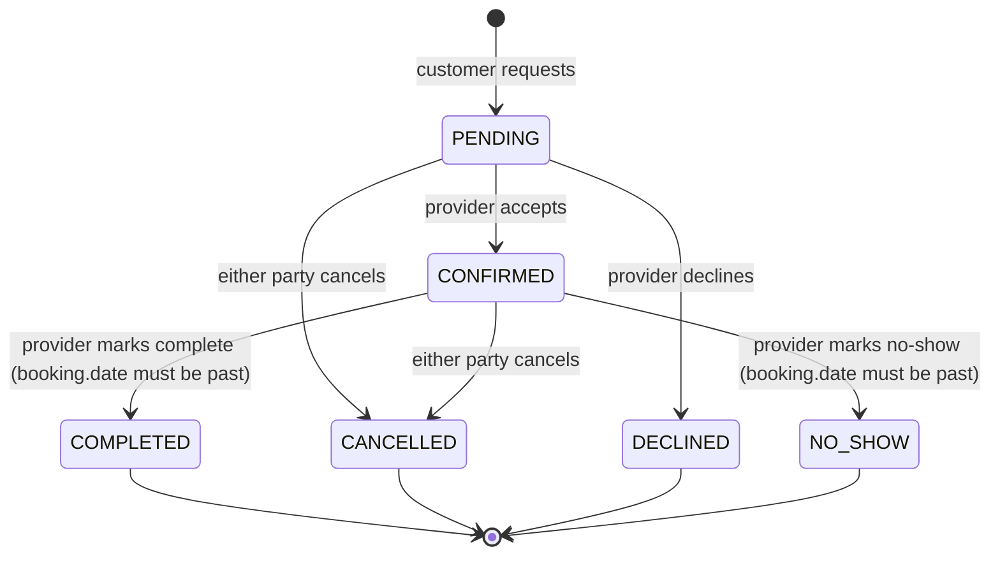

# Features

Functional specification of what Fgrapher currently does, extracted from
the running code (not from the original design intent) as of this writing —
before the Model role is added (see `docs/guides/fgrapher-prompts-batch-2.md`
for why this document is deliberately generated at this point in the
build).

## Feature flags — what's live right now

Three flags in `src/lib/env.ts`/`src/lib/features.ts`, all default `false`.
Code behind a disabled flag is **not deleted** — it's exactly what's
described below, kept dormant. See `docs/MVP_SCOPE.md` and CLAUDE.md's
"Ràng buộc bắt buộc" for the full reasoning.

| Flag                  | Status  | Why off                                                                                                                                                                                                                                                                                                                            |
| --------------------- | ------- | ---------------------------------------------------------------------------------------------------------------------------------------------------------------------------------------------------------------------------------------------------------------------------------------------------------------------------------- |
| `BILLING_ENABLED`     | **off** | Stripe doesn't support Vietnam-registered merchant accounts. Plans are assigned manually (§2).                                                                                                                                                                                                                                     |
| `MARKETPLACE_ENABLED` | **off** | Out of MVP scope — see `docs/guides/fgrapher-danh-gia-va-prompt-sua-doi.md` Prompt B6. `/shop`, `/cart`, `/checkout`, listings/orders dashboard pages, and every `products`/`shop-products`/`cart`/`orders` API route return 404; the Camera Shop role is hidden from registration, `/browse`, pricing, and the landing page (§9). |
| `SOCIAL_FEED_ENABLED` | **off** | Out of MVP scope, same source. Hides the Follow button/count and 404s `/api/follows*`; `Post`/`Like`/`Comment` were never wired to any UI or API to begin with, flag or no flag (§9a).                                                                                                                                             |

Flipping a flag back to `true` (env var, not code) re-enables everything
described in this document for that feature — nothing needs to be
un-commented or rebuilt.

## 1. Accounts and roles

**Who can use it:** everyone.

Registration happens at `/login?mode=register` (a tab on the combined
auth page — `/register` still works as a redirect for old links). A
registrant picks **Customer** (free) or **Creative pro**, and if Creative
pro, one or more of: Photographer, Videographer, Make-up Artist, Studio,
Camera Shop — every selected role becomes its own `UserRole` row and its
own Stripe subscription line item. Auth is via email/password (bcrypt) or
Google OAuth; OAuth sign-ins are trusted as email-verified automatically,
credentials sign-ins require a verified email (`emailVerified` set) before
`signIn` succeeds.

**Multi-role behaviour:** one `User` can hold any combination of roles
simultaneously. Each paid role gets its own `Profile` row (own portfolio,
pricing, services) and its own subscription — cancelling one role's
subscription only deactivates that role and unpublishes that role's
profile; other active roles are unaffected (`handleSubscriptionDeleted` in
`services/subscription.ts` scopes every write to the specific `UserRole`
IDs tied to the cancelled Stripe subscription).

**Free vs paid:** Customer is free forever, no card required, cannot
upload media, list services, or receive bookings. Every other role is paid
— see §2.

## 2. Subscriptions

**Who can use it:** anyone selecting a paid role at registration, or adding
one later from `/dashboard/settings/roles`.

**⚠️ Currently disabled (`BILLING_ENABLED=false`, see CLAUDE.md and
`docs/MVP_SCOPE.md`):** Stripe can't take a merchant account for a
Vietnam-registered business. Everything below this line describes the
Stripe-backed flow as it exists in code, kept dormant behind the flag —
none of it is live today. What actually happens instead: every paid role
selected at registration gets a free 12-month plan immediately
(`services/subscription.ts`'s `assignFreePlan`, called from
`/api/auth/register`), and admins can assign/extend a plan manually from
`/admin/users/[id]` (`assignManualPlan`) — no payment ever collected. The
`/onboarding/billing` step and `/dashboard/settings/billing`'s Stripe UI
are replaced with a simple "currently free" message while the flag is
off.

- **Trial:** every new paid-role checkout starts a 14-day free trial
  (`trial_period_days: 14`, `lib/stripe.ts`'s `createCheckoutSession`).
- **Billing cycle:** monthly or yearly, chosen at checkout. Yearly is
  `monthly × 12 × 0.8` — a flat 20% discount, billed once a year
  (`lib/constants/plans.ts`).
- **Pricing (VND/month):** Photographer 390,000 · Videographer 390,000 ·
  Make-up Artist 390,000 · Camera Shop 490,000 · Studio 690,000.
- **On failed payment:** the subscription moves to `PAST_DUE` and gets a
  **7-day grace period** (`GRACE_PERIOD_DAYS`, `services/subscription.ts`).
  The role/profile stays fully live through the grace period —
  `requireActiveSubscription`'s `isSubscriptionUsable` check treats
  `PAST_DUE` as usable until `graceEndsAt` passes. A "payment failed" email
  fires immediately; the user is not gated out until the grace period
  actually expires.
- **On subscription end** (Stripe `customer.subscription.deleted`, i.e.
  cancellation took effect or grace period exhausted with no successful
  retry): the `UserRole` is deactivated and its `Profile.isPublished` is
  forced to `false` in the same transaction — the profile disappears from
  search/browse but the underlying data is kept (soft, not deleted).
- **Cancellation:** `cancel_at_period_end` via the Stripe Customer Portal
  (`/api/stripe/portal`) — access continues through the current paid
  period; a "your subscription is set to cancel" email fires the first
  time this flag flips true.
- **Reactivation:** `resumeSubscription` (`/api/stripe/resume`) clears
  `cancel_at_period_end` before the period ends; after it ends, the user
  goes through checkout again like a new subscriber.

## 3. Profiles

**Who can use it:** any user with at least one active paid role
(publishing); anyone can view a published profile.

Each `Profile` row (one per role) holds: display name, description, social
links, pricing range, categories (from the shared `ProfileCategory` enum —
photography/videography styles, makeup styles, or studio amenity-adjacent
types depending on role), and role-specific fields (Studio: address, area,
amenities; Camera Shop: shop name). `isPublished` gates search visibility —
there is no separate "completeness score" gate in the code; a profile with
`isPublished: true` and zero portfolio media is not blocked from appearing
in search, though the UI encourages filling it in.

## 4. Portfolio

**Who can use it:** any active paid role.

`ProfileMedia` rows (images or videos) attach to a `Profile`, uploaded
directly from the browser to Cloudinary via a short-lived signed upload
(`/api/upload/signature`, `lib/cloudinary.ts`) — the app server never
proxies the file bytes. The upload signature bakes in an incoming
`fl_strip_profile` transformation, so EXIF/GPS metadata is stripped from
the stored asset itself, not just the delivered view of it. Upload is
capped per role's `maxPortfolioImages` (`lib/constants/plans.ts`, 30
today for every role) — the pricing page's "Unlimited uploads" copy
predates this and should be corrected. A rights-confirmation checkbox
("I confirm I have the rights to use these images...") is required on
every upload, unticked by default; the server stamps
`rightsConfirmedAt` itself. Ordering is drag-and-drop (`@dnd-kit`,
`/api/portfolio/reorder`, persisted as each row's `order` integer).
Deletion removes the DB row; the Cloudinary asset is removed via
`deleteCloudinaryAsset` using the stored `publicId`.

**Moderation:** every upload starts `moderationStatus: PENDING` and is
run through `services/moderation.ts`'s `contentScanner` (currently
`MockScanner`, which always defers to human review — swap the one
`contentScanner` assignment to plug in a real scanner later). Only
`APPROVED` media is ever returned to public viewers (`public-profile.ts`,
`search.ts`); the owner's own dashboard view is unfiltered and shows a
Pending/Rejected badge. A profile can't be published (`isPublished:
true`) without at least one `APPROVED` photo, on top of the identity-
verification requirement (§3). Admins review the queue at
`/admin/moderation` (bulk approve/reject, keyboard shortcuts, 24h SLA
badge); a scanner-flagged (`AUTO_REJECTED`) upload adds a strike to
`User.violationPoints`, auto-suspending the account at 3 strikes.

## 5. Search and discovery

**Who can use it:** everyone (public route, `/browse`).

`services/search.ts`'s `searchProfiles()` — see `docs/ARCHITECTURE.md` §5
for the full request trace. Filters: role (multi-select), free-text query
(matches `displayName`, `description`, `shopName`, or the user's `name`,
case-insensitive `contains`), city (exact match, case-insensitive), price
range (`priceMin`/`priceMax` overlap against the query range), category,
and minimum rating. Sort options: top rated (default), price ascending,
price descending, newest, most reviewed.

**Ranking:** there is no weighted relevance score — sort is a single field
comparison (`avgRating`, `priceMin`, `createdAt`, or `reviewCount`
descending/ascending per the chosen option). A profile appears in results
only if `isPublished: true` and it matches every active filter; a
multi-role person's card shows all of that person's published roles even
if only one matched the active role filter, because matching is done at
the `userId` level after the initial `Profile` match (see
`groupProfilesByUser`).

`/browse`'s filter UI has its own optimistic-update/debounce/batching
design covered in `src/components/browse/filter-sidebar.tsx` — a real bug
in the naive version of this (clicks clobbering each other under Next.js's
async navigation) was diagnosed and fixed; see that file's comments for
the mechanism if touching this area again.

## 6. Booking

**Who can use it:** Customer → any provider role; a provider role can also
book another provider role in some cases per the "who can book whom" table
(currently only Customer books providers — see `docs/guides/
fgrapher-prompts-batch-2.md` §3a for the Model-role addition that
introduces Photographer/Videographer → Model booking).

- **Who triggers each transition:** only the provider can `CONFIRMED`,
  `DECLINED`, `COMPLETED`, or `NO_SHOW` a booking; either party can
  `CANCELLED` it, at any point, with **no minimum-notice-to-cancel rule
  enforced in code** (see the Business rules appendix — this is a real gap,
  not a deliberate no-limit policy like portfolio uploads).
- **Timing rules:** a new booking request needs **at least 24 hours**
  notice (`MIN_NOTICE_HOURS`, `services/bookings.ts` and independently
  `services/availability.ts` — both hardcode `24`, see the appendix).
  `COMPLETED`/`NO_SHOW` can only be set once `booking.date` is in the past.
- **Overlap protection:** `createBooking` re-checks for an overlapping
  `PENDING`/`CONFIRMED` booking for that provider **inside a DB
  transaction**, immediately before insert, closing the race window
  between two customers booking the same slot concurrently.
- **Reschedule:** either party can propose a new date/time
  (`rescheduleProposed*` fields on `Booking`); the other party must
  explicitly accept or decline — accepting overwrites `date`/`startTime`/
  `endTime` and clears the proposal, declining just clears it. Only
  `PENDING`/`CONFIRMED` bookings can have a reschedule proposed.
- **Reminders:** a daily cron (`/api/cron/booking-reminders`, protected by
  `CRON_SECRET`) emails both parties once for any `CONFIRMED` booking
  happening tomorrow, guarded by `reminderSentAt` so re-running the cron
  the same day is a no-op.
- **Every transition** notifies the other party (in-app + email per their
  notification preferences — see §11) and, on creation, opens/uses a
  `Conversation` and posts a `booking_link`-type message so the request is
  immediately visible in messaging too.

## 7. Availability

**Who can use it:** provider roles configure it; anyone viewing a profile
sees the resulting open slots.

Computed on the fly (not stored) by `services/availability.ts` from three
inputs: weekly recurring `Availability` windows (`dayOfWeek` + start/end
time), one-off `BlockedDate` rows, and existing `PENDING`/`CONFIRMED`
bookings (which occupy `[startTime, startTime + service.duration)`, not
just their start slot). Slots are generated in fixed 60-minute steps
within each weekly window; a slot is available only if it doesn't overlap
an existing booking **and** clears the same 24-hour minimum-notice rule
used at booking creation. All date math is UTC-anchored deliberately (see
the comment at the top of that file) to avoid off-by-one-day bugs for the
app's Vietnam-based (UTC+7) audience — never local-timezone `Date` methods
here.

## 8. Messaging

**Who can use it:** any two users who share a `Conversation` — created
automatically on the first booking request between two people, or directly
via `/api/conversations`.

- **Real-time behaviour:** polling, not sockets — see
  `docs/ARCHITECTURE.md` §7 for the exact intervals (chat panel 4s,
  conversation list 15s, notification bell 30s) and why.
- **Read receipts:** per-participant `lastReadAt` on
  `ConversationParticipant`, updated via `/api/conversations/[id]/read`;
  unread counts are computed from `Message.readAt`/`createdAt` against
  that timestamp.
- **Blocking:** `BlockedUser` is a one-directional row
  (`@@unique([blockerId, blockedId])`) but message-sending checks both
  directions (`{blockerId: A, blockedId: B} OR {blockerId: B, blockedId:
A}`) — either party blocking stops messages both ways, not just from the
  blocker.

## 9. Marketplace (Camera Shop)

**⚠️ Currently hidden (`MARKETPLACE_ENABLED=false`, see the flags table
above):** every page and API route this section describes returns
404/not-found, the Camera Shop role is unselectable at registration and
filtered out of `/browse`, pricing, the landing page, and site
navigation. Everything below describes the real, fully-built flow as it
exists in code — just dormant, not deleted.

**Who can use it:** Camera Shop role lists/manages; any authenticated user
buys/rents.

- **Listing:** `Product` with `type` SALE, RENT, or BOTH; `condition`
  (NEW/LIKE_NEW/GOOD/FAIR); soft-deletable (`deletedAt`).
- **Cart:** `CartItem` — for a `RENT` item, `rentalStart`/`rentalEnd` are
  part of the uniqueness key, so the same product with different rental
  dates is two separate cart lines. Adding a rental item checks for date
  overlap against any other order for that product currently `PENDING`,
  `CONFIRMED`, or `SHIPPED` before allowing it into the cart. Quantity is
  capped at 99 per line (`marketplace.ts` validation).
- **Checkout:** one Stripe Checkout session per cart, but **orders are
  split one-per-shop** even from a single multi-shop cart (`createOrders
FromCheckout` groups cart items by `product.userId`) — this is also
  exactly what Stripe Connect (payout splitting) would have required, so
  the data model is already correct for that even though payments
  currently settle to the platform account (see `docs/ARCHITECTURE.md`
  §9's Stripe row).
- **Orders:** `PENDING → CONFIRMED → SHIPPED → DELIVERED`, or
  `CANCELLED`/`RETURNED` off any state. Cancelling restocks `SALE` items
  and attempts a Stripe refund (best-effort — failure is swallowed, not
  surfaced, via `.catch(() => {})` in `updateOrderStatus`). Only the shop
  can advance status forward; either party can cancel.
- **Rental deposits:** `depositAmount` is charged upfront at checkout
  (folded into the Stripe line item total) and tracked via
  `DepositStatus` (`HELD` → `REFUNDED` or `DEDUCTED`), set explicitly by
  the shop via `markRentalReturned` — there is no automatic
  deposit-refund trigger; a shop must mark a rental returned.

## 9a. Social feed (Follow)

**⚠️ Currently hidden (`SOCIAL_FEED_ENABLED=false`, see the flags table
above):** `/api/follows` and `/api/follows/status`'s follow lookup 404/
no-op; the Follow button and follower count are hidden from
`ProfileActions` on public profiles.

Of the four social-feed models in the schema (`Post`, `Like`, `Comment`,
`Follow`), only `Follow` was ever actually wired to a UI or API —
`Post`/`Like`/`Comment` have zero application code touching them (no
routes, no service functions), independent of this flag. Following is a
simple one-directional `Follow` row (`followerId`/`followingId`) with no
notification currently sent on follow (the `NEW_FOLLOWER` `NotificationType`
and its `newFollower` preference key exist but nothing calls `notify()`
with that type). `/api/follows/status` also serves the **unrelated,
always-on** "Save profile" bookmark state (`SavedProfile` — a different,
in-scope feature) in the same response, so that endpoint itself is never
404'd wholesale — only the follow half of it goes inert.

## 10. Reviews

**Who can use it:** the customer side of a booking, once.

- **Eligibility:** the reviewer must be the booking's customer, the
  booking must be `COMPLETED`, no review can already exist for that
  booking (`Review.bookingId` is unique — enforced at the DB level too),
  and the review must be submitted within **30 days** of `completedAt`
  (`REVIEW_WINDOW_DAYS`, `services/reviews.ts`).
- **Editing:** the reviewer can edit their review within **7 days** of
  posting (`EDIT_WINDOW_DAYS`). The provider can post one response, and
  edit that response within **24 hours** of posting it
  (`RESPONSE_EDIT_WINDOW_HOURS`) — note this is a different 24-hour window
  than the booking minimum-notice rule; see the appendix for the
  duplicate-value flag.
- **Aggregation:** `getProviderReviewStats` computes `avgRating` as a
  simple mean over all of a provider's reviews (not weighted/decayed), a
  response rate (`responded / total`), and surfaces `awaitingResponse`
  count for the provider's dashboard.

## 11. Notifications

**Who can use it:** every user, in-app always; email per-category opt-out.

23 `NotificationType` values (bookings ×7, messaging/social ×4,
subscription/billing ×4, marketplace ×5, reviews ×2, admin-adjacent).
`services/notification.ts`'s `notify()` looks up the user's
`notificationPreferences` JSON blob per category (`bookingRequest`,
`bookingConfirmed`, `bookingCancelled`, `bookingReminder`, `newMessage`,
`newFollower`, `newReview`, `productUpdates`, `tips` — each `{email,
inApp}`); types with no mapped preference key (likes, comments) always go
in-app only, email is never sent for them regardless of settings. Billing
and account-critical events (`notifyCritical` — welcome, payment failed,
subscription cancelled/ended) **bypass preferences entirely**, same
principle as password-reset email: the user must see these no matter their
settings.

Delivery is: write a `Notification` row (in-app, read by the bell/list) and
optionally call `sendEmail()` (no-ops without `RESEND_API_KEY`). There is
no push notification channel.

## 12. Admin

**Who can use it:** users with an active `ADMIN` `UserRole` — not
selectable at registration, granted only via `scripts/make-admin.ts`.

- **Overview dashboard** (`getAdminStats`): total users + month-over-month
  growth %, active subscriptions, MRR (sum of each active subscription's
  monthly plan price — does not account for yearly subscriptions'
  amortized monthly value, it just uses the flat `monthly` figure per
  role), bookings this month + completion rate, booking GMV and order GMV
  for the current month, count of `PAST_DUE` subscriptions, pending
  reports, subscriptions expiring within 7 days. Plus a merged recent-
  activity feed (signups + bookings + reports, newest first).
- **User management**: search/filter by name/email/username/role; per-user
  detail view; actions — `suspendUser`/`unsuspendUser` (with reason +
  optional `until` date), `verifyUser`, `softDeleteAdminUser` (sets
  `deletedAt`, does not hard-delete), free-text `adminNotes`. **Every
  action listed here should be paired with `logAdminAction()`** per the
  convention in `lib/admin.ts` — verify this at the call site, since the
  service functions themselves don't enforce it.
- **Moderation queue**: `Report` rows (loose `targetType`/`targetId`
  reference, not a Prisma relation, since a report can point at a review,
  user, message, or product), filterable by status/type, resolved via
  `resolveReport()` to `RESOLVED`/`DISMISSED`/`REVIEWING` with a note.

---

## Business rules appendix

Extracted from code, not assumption. Cross-checked for duplication.

| Rule                                       | Value                                    | Source                                                                                                                                                                                                                                                                                                                    |
| ------------------------------------------ | ---------------------------------------- | ------------------------------------------------------------------------------------------------------------------------------------------------------------------------------------------------------------------------------------------------------------------------------------------------------------------------- |
| Minimum booking notice                     | 24 hours                                 | `services/bookings.ts` `MIN_NOTICE_HOURS`, independently re-declared (same value) in `services/availability.ts` `MIN_NOTICE_HOURS` — **duplicated in two places with the same value today; a future change to one and not the other would silently desync booking creation from the availability calendar it's based on** |
| Booking cancellation notice                | **none enforced**                        | `updateBookingStatus` allows `CANCELLED` from `PENDING`/`CONFIRMED` with no time-based check — flagged because most booking platforms have one; confirm this is intentional                                                                                                                                               |
| Review submission window                   | 30 days after booking completion         | `services/reviews.ts` `REVIEW_WINDOW_DAYS`                                                                                                                                                                                                                                                                                |
| Review edit window                         | 7 days after posting                     | `services/reviews.ts` `EDIT_WINDOW_DAYS`                                                                                                                                                                                                                                                                                  |
| Review response edit window                | 24 hours after posting the response      | `services/reviews.ts` `RESPONSE_EDIT_WINDOW_HOURS` — same numeric value as the booking-notice rule above but an unrelated concept; not a real duplicate, flagged only so the two aren't confused when grepping for "24"                                                                                                   |
| Subscription trial length                  | 14 days                                  | `lib/stripe.ts` `createCheckoutSession` (`trial_period_days: 14`)                                                                                                                                                                                                                                                         |
| Subscription payment-failure grace period  | 7 days                                   | `services/subscription.ts` `GRACE_PERIOD_DAYS`                                                                                                                                                                                                                                                                            |
| Yearly billing discount                    | 20% off (monthly × 12 × 0.8)             | `lib/constants/plans.ts` `YEARLY_DISCOUNT`                                                                                                                                                                                                                                                                                |
| Portfolio upload limit                     | 30 per role                              | `lib/constants/plans.ts` `maxPortfolioImages` — pricing page's "Unlimited uploads" copy is now stale, not yet corrected                                                                                                                                                                                                   |
| Media moderation SLA (admin review target) | 24 hours                                 | `lib/constants/index.ts` `MEDIA_MODERATION_SLA_HOURS`                                                                                                                                                                                                                                                                     |
| Content-violation auto-suspend threshold   | 3 strikes                                | `services/moderation.ts` `SUSPENSION_THRESHOLD`                                                                                                                                                                                                                                                                           |
| KYC document retention after approval      | 90 days, then purged                     | `services/admin.ts` `KYC_PURGE_AFTER_DAYS`, cron `/api/cron/purge-kyc-documents`                                                                                                                                                                                                                                          |
| Data-request (export/deletion) SLA         | 30 days                                  | `lib/constants/index.ts` `DATA_REQUEST_SLA_DAYS`                                                                                                                                                                                                                                                                          |
| Booking reference-image attachments        | max 5                                    | `lib/validations/booking.ts` (`referenceImages: z.array(...).max(5)`)                                                                                                                                                                                                                                                     |
| Marketplace cart line quantity             | max 99                                   | `lib/validations/marketplace.ts`                                                                                                                                                                                                                                                                                          |
| API rate limiting                          | **none exists anywhere in the codebase** | no rate-limit library/middleware found — every route is only gated by auth, not request volume                                                                                                                                                                                                                            |
| Booking availability slot granularity      | 60 minutes                               | `services/availability.ts` `SLOT_MINUTES`                                                                                                                                                                                                                                                                                 |
