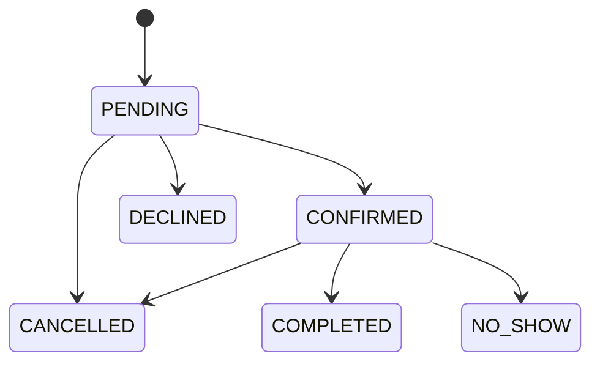

# Giai đoạn 6 — Đặt lịch

> Tài liệu lịch sử của luồng booking.

## Mục tiêu

- Chọn dịch vụ, ngày/giờ và thông tin liên hệ.
- Tính availability.
- Tạo booking an toàn khi có request đồng thời.
- Quản lý trạng thái và thông báo.

## 1. Wizard đặt lịch

Các bước thường gồm:

1. chọn dịch vụ;
2. chọn ngày và khung giờ;
3. nhập chi tiết cần thiết;
4. xem lại và xác nhận.

State giữa các bước cần được validate lại. Khi service/date đổi, slot và giá phụ thuộc
phải được làm mới. Người dùng quay lại bước trước không được mất dữ liệu hợp lệ.

## 2. Availability

Khung giờ được tính từ:

- lịch làm việc;
- ngày bị chặn;
- booking pending/confirmed;
- thời lượng dịch vụ;
- thời gian báo trước;
- timezone.

API đọc availability có thể public nhưng chỉ trả thông tin cần để đặt, không trả lịch
riêng hoặc thông tin khách khác.

## 3. Tạo booking và chống race

Client thấy slot trống không đảm bảo nó vẫn trống lúc gửi. Service phải kiểm tra lại
bên trong transaction ngay trước insert.

Cơ chế:

- unique/constraint nếu mô hình cho phép;
- query overlap trong transaction;
- update/create có điều kiện;
- trả 409 hoặc lỗi nghiệp vụ rõ khi slot vừa bị lấy;
- idempotency nếu nút submit có thể gửi lặp.

## 4. State machine

Provider xử lý accept/decline/complete/no-show; hai bên có thể huỷ theo policy. Server
kiểm tra caller và trạng thái hiện tại trong cùng thao tác cập nhật.

## 5. Đề xuất đổi lịch

Một bên đề xuất ngày/giờ mới; bên kia accept hoặc decline. Trước khi accept phải kiểm
tra slot mới và xung đột. Đề xuất cũ phải được xoá/ghi trạng thái rõ để không áp dụng
lại.

## 6. Thông báo và email

Mỗi sự kiện booking tạo notification phù hợp. Email đi qua outbox/idempotency. Booking
thành công không rollback chỉ vì email lỗi.

Cron nhắc lịch:

- chỉ booking confirmed đủ điều kiện;
- đánh dấu `reminderSentAt` hoặc idempotency key;
- chạy lặp không gửi trùng;
- dùng timezone Việt Nam theo policy.

## 7. Quản lý booking

List, calendar và detail phải dùng cùng policy:

- chỉ customer/provider liên quan;
- phone/address chỉ hiện khi được phép;
- email có chính sách rõ;
- action chỉ hiện và chỉ chạy ở transition hợp lệ;
- dữ liệu nhạy cảm không nằm trong response thừa.

## 8. Giá và tiền

Server lấy giá từ Service/offer hợp lệ; không tin giá client gửi. Dùng VND và helper
format chung. Nếu booking không thu tiền, UI không được tạo cảm giác đã thanh toán.

## 9. Kiểm tra

- hai khách đặt cùng slot;
- double-click submit;
- slot qua nửa đêm/timezone;
- minimum notice;
- accept/decline/cancel bởi sai người;
- transition từ trạng thái cuối;
- reschedule xung đột;
- list/calendar/detail che PII giống nhau;
- reminder chạy hai lần;
- email lỗi nhưng booking vẫn tồn tại.

## Khác với kế hoạch ban đầu

Booking hiện tích hợp hội thoại, service request/offer, reminder, outbox và nhiều
policy bảo mật hơn. Luồng phải đi qua `src/services/bookings.ts`, không copy logic
vào route/component.
